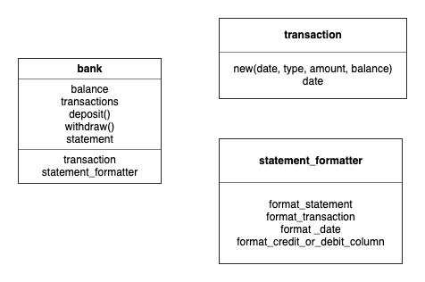

# APPROACH

### Session 01

**Mon 1 Jul 2019 12:23 - Mon 1 Jul 2019 13:07**

**To do**

- Initialise project (readme, approach)
- Read the spec
- Install timer widget
- Detail readme with spec
- Set up testing environment
 - Rspec, coverage, linter
- Initial commit

**Done**

- Initialise project (readme, approach)
- Read the spec
- Install timer widget
- Detail readme with spec
- Set up testing environment
 - Rspec, linter
 ```
 bundle init
 ```
Add rspec to gemfile
```
 bundle
 rspec init
 ```
 - Researched linter for a second, chose rubocop. They recommend using a specific version in the gemfile
 to prevent updates causing backward compatibility issues:
 ```
 gem 'rubocop', '~> 0.72.0', require: false
 ```
 - Ran bundle then:
 ```
rubocop
 ```
 to check it works and then:
 ```
ruboocop -a
 ```
 to see how many offences it could automatically fix.

 - Included simplecov in gemfile, looked for a way to format it nicely and realised it might do that auto. Will find out when a test is written.
- Made a .gitignore and added the coverage/ folder to it.
- Initial commit: added new github repo as remote origin, pushed commit

### Session 02

**Mon 1 Jul 2019 13:19 - Mon  1 Jul 2019 14:12**

**To do**
- Write user stories
- Model the user experience

**Done**
- Wrote user story one
- Wrote user story two
- Wrote user story three
- Asked coach to clarify the requirements about storage in memory
- Modelled user story one

### Session 3

**Mon 1 Jul 2019 14:14 - Mon 1 Jul 2019 14:52**

**To do**
- Model user story two and three
- Test story one

**Done**
- Modelled user stories and added them to readme
- Wrote a test for bank class
  - Created Bank file with class
  - Required Bank file in spec helper


- Test for deposit method
  - Created deposit method
  - Tested in terminal:

    ```
    $ irb -r ./Bank.rb
    2.6.0 :001 > Bank.deposit(1)
     => "You deposited 1"
    ```

- Updated models to reflect method change
- Commit

### Session 4

**Mon 1 Jul 2019 14:57 - Mon 1 Jul 2019 15:43**

**To do**
- Setup simplecov console format
- Test story two

**Done**
- Added simplecov console format:
  - Added simplecov console gem in gemfile, ran bundle
  - Added formatter to spec_helper
- Test for withdraw method
  - Created deposit method
  - Tested in terminal:

    ```
    $ irb -r './Bank.rb'
    2.6.0 :001 > Bank.withdraw(5000)
     => "You withdrew 5000"
    ```
- Test for withdrawal limit
  - Realised it wasn't in the spec so deleted it

### Session 5

**Mon 1 Jul 2019 15:45 - Mon 1 Jul 2019 16:16**

**To do**
- Test story three

**Done**
- Started writing a test to see the statement
  - Flailed with multiline string format
  - Realised test is too big
- Test just for balance
  - Wrote a test and passed it
  - The test needs to calculate the actual balance, not just return a string that passes the test
  - So, included a random deposit and withdrawal amount
  - Made a balance constant in the Bank class
  - Changed the Bank file to instance itself on loading
    - Changed the constant to an instance variable
    - Changed the methods from class to instance
    - Created a new instance of Bank with @ on the last line, called @bank
  - The earlier test became redundant, so deleted it
- Tested in IRB:

  ```
  irb -r ./Bank.rb
  #<Bank:0x00007f9c9113b598 @balance=0>
  2.6.0 :001 > @bank.deposit(10)
  => "You deposited 10"
  2.6.0 :002 > @bank.withdraw(5)
  => "You withdrew 5"
  2.6.0 :003 > @bank.balance
  => "Your balance is 5"
  ```
- Commit

### Session 6

**Mon  1 Jul 2019 16:31 - Mon  1 Jul 2019 17:02**

**To do**
- Diagram the domain
  - Record transactions
  - Get a list of transactions

**Done**
- CRC cards

  
- Test for Transaction class
- Made a Transaction file and moved it into a lib folder with the Bank file
- Tested that Transactions have to be initialized with three arguments

### Session 7

**Mon  1 Jul 2019 17:19 - Mon  1 Jul 2019 17:53**

**To do**
- Test bank for list of transactions
- Test adding a transaction to list
- Test transaction read format
- Commit


**Done**
- Test bank for list of transactions
- Test transaction for storing arguments
  - Use particular time formatting
  - Tested the first entry in the array
