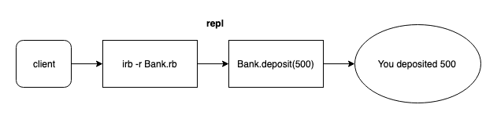

# BANK TECH TEST

## How to use

- In terminal, clone this repository:

  ```
  git@github.com:n3ttl3t/bank-tech-test.git
  ```
- Navigate into the root directory:

  ```
  cd bank-tech-test
  ```
- Run IRB with the main file:

  ```
  irb -r ./lib/Bank
  ```
- Now you can use the following commands:

  ```
  > @bank.deposit(2000)
   => "You deposited 2000"

   > @bank.withdraw(550)
  => "You withdrew 550"

  > @bank.balance
 => 1450
  ```
  You can enter any amounts you like.

- You can also see your transaction history, with the most recent at the top:
  ```
  > @bank.statement
"date || credit || debit || balance"
"07/01/19 ||  || 550.00 || 1450.00"
"07/01/19 || 2000.00 ||  || 2000.00"
  ```

### To run tests
- After downloading, in the root directory, install the necessary gems:
```
bundle
```
- Run the tests to see coverage:
```
rspec -fd
```
- Run the linter to see style adherence:
```
rubocop
```
---

#### This practice session is about producing the best code I can when there is a minimal time pressure.

#### I'll get to practice my OO design and TDD skills.

---

### Specification

#### Requirements

* You should be able to interact with your code via a REPL like IRB or the JavaScript console.  (You don't need to implement a command line interface that takes input from STDIN.)
* Deposits, withdrawal.
* Account statement (date, amount, balance) printing.
* Data can be kept in memory (it doesn't need to be stored to a database or anything).

#### Acceptance criteria

**Given** a client makes a deposit of 1000 on 10-01-2012  
**And** a deposit of 2000 on 13-01-2012  
**And** a withdrawal of 500 on 14-01-2012  
**When** she prints her bank statement  
**Then** she would see

```
date || credit || debit || balance
14/01/2012 || || 500.00 || 2500.00
13/01/2012 || 2000.00 || || 3000.00
10/01/2012 || 1000.00 || || 1000.00
```
---

## User stories

**One**

```
As a client,
so I can keep my money safe,
I would like to make a deposit
```


**Two**
```
As a client,
so I can use my money,
I would like to make a withdrawal
```


**Three**
```
As a client,
so I know what transactions I have made and when and how much money I currently have stored,
I would like to see a table of deposits, withdrawals, and balance.
```


---

**Please see the APPROACH.md file for documentation of the development process :)**
